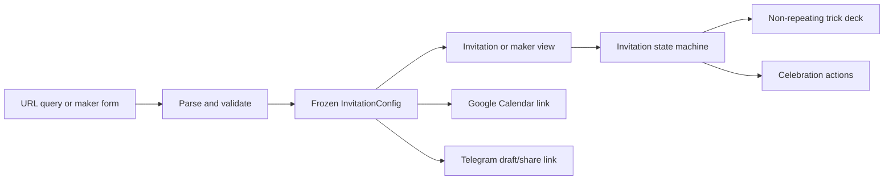
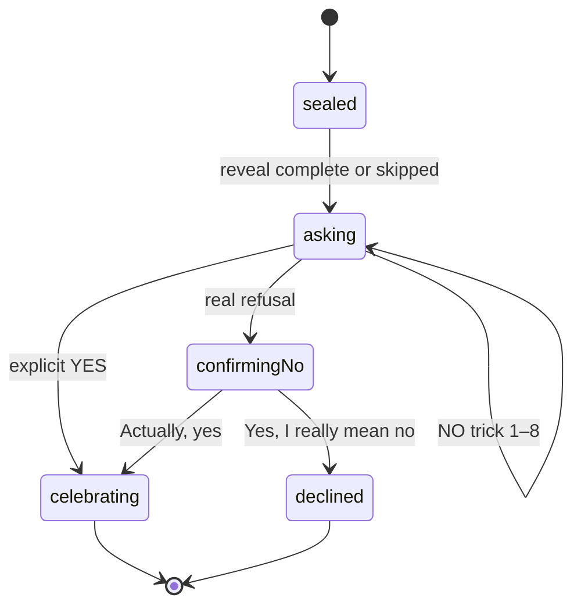

# Jamie Date Invitation — Design Specification

Date: 2026-07-15

Status: Approved in collaborative design review

Deployment target: GitHub Pages

## 1. Summary

Build a mobile-first, single-page romantic invitation that asks Jamie to go on a date. The page feels like a handmade love letter laid on a desk: cream paper, postal marks, tape, a wax seal, handwritten notes, and a slightly imperfect scrapbook composition.

The invitation content is controlled through URL query parameters. A hidden `?make=1` mode provides a form that previews the invitation and generates a shareable URL. The site has no backend and stores no visitor data.

The primary actions are `YES` and `NO`:

- `YES` produces a celebratory transition and then offers explicit buttons to add the event to Google Calendar and open a Telegram chat with a prefilled acceptance message.
- `NO` draws from ten non-repeating playful interactions. After eight attempts, a gentle real-refusal option appears. Selecting it triggers one final humorous confirmation; the second explicit refusal is accepted immediately and respectfully.

## 2. Goals

- Make the invitation feel private, warm, funny, and memorable rather than like a generic landing page.
- Allow date, time, location, names, copy, calendar details, and Telegram details to change entirely through the URL.
- Provide a hidden link generator so the sender does not need to hand-edit encoded URLs.
- Work well on touch devices, pointer devices, and keyboards.
- Never treat an accidental click, label swap, or moving button as consent.
- Deploy as a static site on GitHub Pages with no secrets or server-side code.
- Keep Google Calendar and Telegram as user-confirmed handoffs; neither action occurs automatically.

## 3. Non-goals

- No account system, database, analytics, tracking pixel, or response history.
- No Telegram bot or automatic message sending.
- No Google OAuth or direct writes to a calendar.
- No general-purpose theme editor; the visual direction is intentionally fixed.
- No multi-page router. Invitation mode and maker mode share one entry page.

## 4. Visual direction

### 4.1 Concept

The page is a “love letter that wakes up.” On arrival, a sealed envelope unfolds, followed by the paper, stamp, snapshot, and handwritten annotations. The invitation question appears last so the reveal has a small emotional beat.

### 4.2 Palette and materials

- Cream paper: `#FFFAF2`
- Desk blush: `#F5E7D7`
- Letterpress burgundy: `#AE3550`
- Ink brown: `#562937`
- Faded rose: `#D9A0A8`
- Sage accent: `#A7B8A7`
- Semi-transparent paper tape and a fine dotted paper texture

The visual language uses CSS-rendered paper, postal perforations, doodles, tape, shadows, and a wax seal. It does not require stock imagery.

### 4.3 Typography

- Expressive serif for the invitation question and date ticket
- Handwritten display face for annotations and microcopy
- A restrained readable face for form controls and helper text

Fonts are bundled with the site rather than loaded from a third-party font CDN. The final stack must retain readable local fallbacks.

### 4.4 Composition

- Desktop: a wide “desk” scene with one centered, slightly rotated sheet; photo and stamp break the grid at opposite corners.
- Mobile: a single, nearly full-width letter; decorations move behind or outside the primary reading column.
- The question, date ticket, and actions are the only high-contrast content.
- There is no navigation bar in invitation mode.

### 4.5 Motion

- Entry reveal lasts about 1.4 seconds with staggered paper-layer motion.
- YES celebration lasts about 1.2 seconds before the next actions become available.
- Motion uses transforms and opacity to avoid layout jank.
- `prefers-reduced-motion: reduce` replaces flying, rotating, and confetti motion with short fades and static visual jokes.

## 5. Invitation experience

### 5.1 Arrival

1. Background texture fades in.
2. Envelope opens and letter rises into view.
3. Tape, stamp, photo, and annotations settle into place.
4. Question and date ticket reveal.
5. YES and NO become interactive.

The reveal is decorative only. Content remains present in the accessibility tree and the user can interact as soon as the page is ready.

### 5.2 YES flow

1. Jamie explicitly activates the currently visible YES control.
2. The NO control becomes inert.
3. The letter expands into a floral/heart celebration and changes its heading to `It's a date!`.
4. The page shows two independent actions:
   - `+ GOOGLE CALENDAR`
   - `TELL {notifyName} ON TELEGRAM`
5. Google Calendar and Telegram open only after their own explicit clicks. This avoids popup blocking and preserves user control.

### 5.3 Telegram button label

- Valid `telegram` and valid `notifyName`: `TELL {notifyName} ON TELEGRAM`
- Valid `telegram`, missing `notifyName`, and valid `from`: `TELL {from} ON TELEGRAM`
- Valid `telegram` but neither name exists: `TELL ME ON TELEGRAM`
- Missing or invalid `telegram`: `SHARE ON TELEGRAM`

The label is uppercased for display, while the supplied name preserves its original spelling internally.

### 5.4 Real refusal flow

1. The first eight NO attempts trigger playful tricks from a shuffled, non-repeating deck.
2. After attempt eight, `Okay, I'll behave…` replaces the playful NO control as the real-refusal action.
3. Activating it rolls or folds the letter into a dramatic confirmation card.
4. The confirmation has two unambiguous choices:
   - `Actually, yes` — returns to the YES flow.
   - `Yes, I really mean no` — accepts the refusal.
5. The declined state says: `No worries — thank you for being honest. This little note will behave now.`
6. A refusal never opens Telegram, Calendar, or another external service.

## 6. The ten NO interactions

1. **Runaway RSVP**
2. **Growing Feelings**
3. **Seat Swap**
4. **Cupid Magnet**
5. **Paper Plane**
6. **Yes Garden**
7. **Dramatic Excuse**
8. **Spotlight**
9. **Tiny Disguise**
10. **Return to Sender**

The click-only trigger contract, lifecycle architecture, persistent-state rules, revised behavior of all ten tricks, accessibility requirements, and geometry thresholds are defined by '2026-07-16-click-triggered-tricks-design.md', which supersedes the original pointer-proximity, first-tap touch, stale-click guard, and keyboard-specific trick behavior in this section.

## 7. URL configuration

### 7.1 Example

```text
/jamie-date-invitation/?to=Jamie&from=Alex&date=2026-08-08&time=19%3A30&tz=Asia%2FSingapore&duration=120&place=Somewhere+lovely&telegram=alex_date&notifyName=Alex&note=I+have+a+little+plan...
```

The final GitHub owner and repository are supplied by deployment. The Vite build derives the project-site base path from the repository name, so renaming the repository does not break asset URLs.

### 7.2 Query fields and fallback behavior

| Field | Accepted form | Missing or invalid fallback | Resulting behavior |
| --- | --- | --- | --- |
| `to` | Plain text, max 40 characters | `Jamie` | The question addresses Jamie. |
| `from` | Plain text, max 40 characters | Internal value remains empty; visible signature becomes `someone with butterflies` | Calendar title and notification label use their generic fallbacks. |
| `date` | Strict `YYYY-MM-DD`, real calendar date | Visible `Date to be decided` | Calendar action is disabled. |
| `time` | Strict 24-hour `HH:mm` | Visible `Time to be decided` | Calendar action is disabled. |
| `tz` | Valid IANA time-zone identifier | `Asia/Singapore` | Calendar conversion uses the deterministic default. |
| `duration` | Integer minutes from 15 through 720 | `120` | Calendar end time is two hours after start. |
| `place` | Plain text, max 100 characters | Visible `A little surprise ✦` | The Google Calendar `location` parameter is omitted rather than invented. |
| `title` | Plain text, max 80 characters | `Date with {from} 💌` when `from` exists; otherwise `A very special date 💌` | Used as the Google Calendar event title. |
| `note` | Plain text, max 240 characters | `I've got a little plan, a lot of butterflies, and one very important question…` | Used on the letter and in Calendar details. |
| `telegram` | Public Telegram username without `@` | No direct recipient | Button becomes `SHARE ON TELEGRAM` and opens Telegram's chat picker. |
| `notifyName` | Plain text, max 40 characters | `from`, then `ME` | Used only when a direct Telegram target exists. |
| `tgText` | Plain text, max 500 characters | A message derived from valid invitation fields | Opens as the Telegram draft. |
| `make` | `1` enables maker mode | Invitation mode | No maker UI is visible on a normal invitation URL. |

Invalid fields are treated exactly like missing fields after validation. Unknown query fields are ignored.

### 7.3 Default Telegram draft

The generated draft begins with:

```text
Jamie says YES! 💌 It's a date.
```

It appends date, time, and location only when those values are valid and not fallback display copy. It may append the invitation URL on a final line. The message is prefilled but never sent automatically.

## 8. Hidden invitation maker

### 8.1 Entry

`?make=1` opens maker mode. Invitation mode contains no visible editor link. This keeps Jamie's shared page focused and avoids exposing an accidental setup interface.

### 8.2 Form

The form includes:

- Recipient and sender names
- Date and local time
- Time zone, prefilled from the maker's browser when available
- Duration
- Location
- Invitation note and calendar title
- Telegram username, notification display name, and optional custom draft

Date and time must be valid before the maker can copy a link marked `Ready to send`. Other fields remain optional and use the documented fallbacks.

### 8.3 Output

- Live invitation preview
- Copy link button
- Native share button when supported
- Compact validation summary
- Reset to romantic defaults

The maker keeps form state only in memory. It does not write to local storage, cookies, or a server.

## 9. Architecture

The implementation uses Vite with native TypeScript. It does not use React or a client-side router.

### 9.1 Modules

- `config` — parses, normalizes, validates, and freezes `InvitationConfig`.
- `date-time` — validates IANA time zones, computes the event end, and formats display/calendar values.
- `calendar-link` — builds the Google Calendar event-edit URL.
- `telegram-link` — builds either a direct public-username draft link or a generic share link.
- `trick-deck` — shuffles and dispenses ten non-repeating trick identifiers.
- `invitation-machine` — owns sealed, asking, celebrating, confirming-no, and declined states.
- `tricks` — one isolated implementation per NO trick behind a shared interface.
- `invitation-view` — renders the letter and binds semantic controls.
- `maker-view` — renders the form, validation, preview, and copy/share actions.

Each module exposes typed inputs and outputs; rendering modules do not parse URL fields, and link builders do not read the DOM.

### 9.2 Data flow



### 9.3 State model



## 10. External handoffs

### 10.1 Google Calendar

Use Google's event-edit URL rather than the Calendar API. The link includes encoded `dates`, `stz`, `etz`, `details`, `location`, and `text` parameters. The visitor reviews and saves the event in Google Calendar.

Official reference: <https://developers.google.com/workspace/calendar/api/concepts/inviting-attendees-to-events>

### 10.2 Telegram

When a public username exists, use:

```text
https://t.me/<username>?text=<url-encoded-draft>
```

When no valid direct target exists, use:

```text
https://t.me/share/url?url=<url-encoded-invitation-url>&text=<url-encoded-draft>
```

Both paths populate a draft. Jamie must still select a chat when necessary and press Send.

Official reference: <https://core.telegram.org/api/links>

## 11. Error handling and security

- Query-string content is untrusted input.
- Dynamic text is inserted with `textContent` or equivalent DOM text APIs, never as HTML.
- Control characters are removed and documented length limits are applied before rendering or link construction.
- Invalid date or time keeps the invitation readable but disables Calendar with the explanation `Date needs fixing`.
- Invalid time zones fall back to `Asia/Singapore` and maker mode surfaces the correction.
- Invalid Telegram targets switch to the generic share path.
- External URLs are constructed with `URL` and `URLSearchParams` rather than string concatenation.
- The application contains no credentials or secret environment values.
- External links use safe opener behavior and visually identify the destination.
- Unexpected runtime errors leave a readable static invitation and do not hide the real-refusal path.

## 12. Accessibility and responsive behavior

- Semantic buttons retain accurate accessible names throughout visual changes.
- The visible button label and resulting action always agree.
- Focus indicators are clearly visible against paper textures.
- Important text meets WCAG AA contrast.
- Touch targets are at least 44 by 44 CSS pixels.
- The page works at 320 CSS pixels without horizontal scrolling.
- The final refusal flow is keyboard reachable and never trapped behind pointer-only behavior.
- Decorative elements are hidden from assistive technology.
- Status changes use a polite live region; confetti and doodles are not announced.
- Reduced-motion mode preserves humor through copy, fades, and static transformations.

## 13. Testing strategy

### 13.1 Unit tests

- Query parsing, sanitization, fallbacks, and length limits
- Strict date/time validation and duration bounds
- Calendar date range and URL encoding
- Telegram direct-link and generic-share fallbacks
- `notifyName` label fallback order
- Shuffle-bag uniqueness and reset behavior
- Invitation state transitions and consent invariants
- Every trick consumes the triggering event without invoking YES

### 13.2 Browser tests

- Desktop pointer flow and mobile touch flow
- YES celebration followed by both explicit external actions
- Eight NO attempts followed by the two-stage real refusal
- Seat Swap cannot turn a stale click into YES
- Keyboard-only completion of YES and NO flows
- Reduced-motion rendering
- Maker validation, live preview, copy link, and generated URL round trip
- Root GitHub Pages base path and encoded query strings
- Clean browser console and no failed asset requests

### 13.3 Build gate

Tests and the production build must pass before deployment. GitHub Actions uploads the Vite `dist` artifact only after the test and build jobs succeed.

## 14. GitHub Pages deployment

- Initialize a Git repository and publish it to a GitHub repository named `jamie-date-invitation` by default.
- If that repository name is unavailable, use `jamie-date-invitation-site`.
- Configure Vite's base path from the GitHub repository name during CI.
- Use the official Pages Actions flow: configure Pages, upload the built artifact, and deploy it with the required Pages permissions.
- Keep query parameters intact; no SPA rewrite or `404.html` routing workaround is required.
- The deployed root URL is a safe incomplete/demo invitation until a generated URL supplies valid date and time.

References:

- <https://docs.github.com/en/pages/getting-started-with-github-pages/using-custom-workflows-with-github-pages>
- <https://vite.dev/guide/static-deploy.html#github-pages>

## 15. Acceptance criteria

The feature is complete when all of the following are true:

1. A generated URL renders its recipient, sender, schedule, place, note, and notification label correctly on desktop and mobile.
2. Missing or invalid fields follow the exact fallback table in this specification.
3. YES produces a celebratory state and exposes functioning Google Calendar and Telegram handoffs.
4. Telegram never sends automatically and uses `TELL {NAME}` only when a direct recipient exists.
5. Ten distinct NO tricks exist and are dispensed without repeats within one shuffle bag.
6. After eight NO attempts, the two-stage real-refusal flow works and no external action occurs after refusal.
7. No visual trick can produce YES without a fresh, explicit activation on the visible YES control.
8. Maker mode generates an encoded URL that reproduces the preview exactly.
9. Keyboard, touch, pointer, and reduced-motion modes all retain complete flows.
10. Unit tests, browser tests, and the production build pass.
11. GitHub Pages serves the production artifact without failed asset requests.
12. The final public URL and a ready-to-send generated invitation URL are handed to the user.
